# Simple Docker

## Contents

1. [Part 1. Готовый докер](#part-1-готовый-докер)
2. [Part 2. Операции с контейнером](#part-2-операции-с-контейнером)
2. [Part 3. Мини веб-сервер](#part-3-мини-веб-сервер)
2. [Part 4. Свой докер](#part-4-свой-докер)
2. [Part 5. Dockle](#part-5-dockle)
2. [Part 6. Базовый Docker Compose](#part-6-базовый-docker-compose)

## Part 1. Готовый докер

##### Возьми официальный докер-образ с **nginx** и выкачай его при помощи `docker pull`.
- Выкачиваем фициальный докер-образ с **nginx** при помощи `docker pull` \
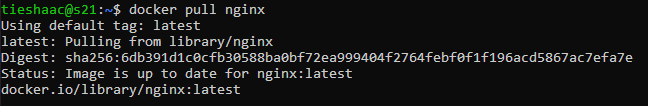

##### Проверь наличие докер-образа через `docker images`.
- Проверяем наличие докер-образа через `docker images` \
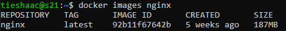

##### Запусти докер-образ через `docker run -d [image_id|repository]`.
- Запускаем докер-образ через `docker run -d nginx` \
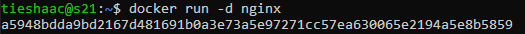

##### Проверь, что образ запустился через `docker ps`.
- Проверяем, что образ запустился через `docker ps` \
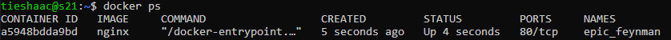

##### Посмотри информацию о контейнере через `docker inspect [container_id|container_name]`.
- Смотрим информацию о созданном контейнере через `docker inspect epic_feynman` \
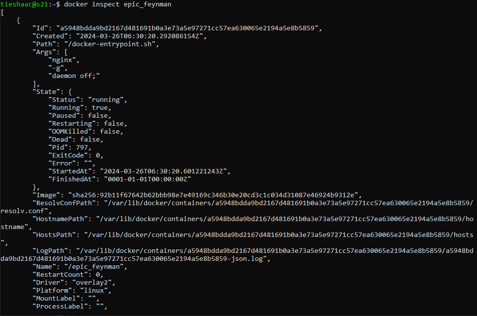

##### По выводу команды определи и помести в отчёт размер контейнера, список замапленных портов и ip контейнера.
- Размер контейнера: \
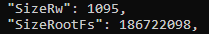

- Список замапленных портов: \
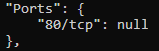

- IP контейнера: \
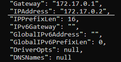

##### Останови докер образ через `docker stop [container_id|container_name]`.
- Остановим докер образ через `docker stop epic_feynman` \
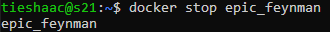

##### Проверь, что образ остановился через `docker ps`.
- Проверим, что образ остановился через `docker ps` \

##### Запусти докер с портами 80 и 443 в контейнере, замапленными на такие же порты на локальной машине, через команду *run*.
- Запустим докер с портами и проверим, что образ запустился через `docker ps` \
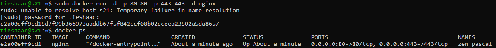

##### Проверь, что в браузере по адресу *localhost:80* доступна стартовая страница **nginx**.
- Проверим, что в браузере по адресу *localhost:80* доступна стартовая страница **nginx**: \
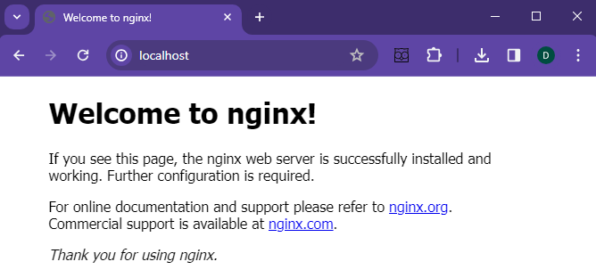

##### Перезапусти докер контейнер через `docker restart [container_id|container_name]`.
- Перезапустим докер контейнер через `docker restart zen_pascal`: \
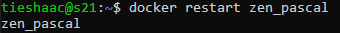

##### Проверь любым способом, что контейнер запустился.
- Проверим, что контейнер запустился через `docker ps`: \
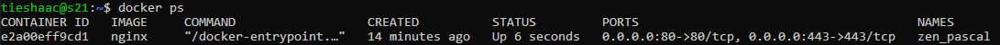

## Part 2. Операции с контейнером

##### Прочитай конфигурационный файл *nginx.conf* внутри докер контейнера через команду *exec*.
- Прочитаем конфигурационный файл *nginx.conf* внутри докер контейнера через команду *exec*: \
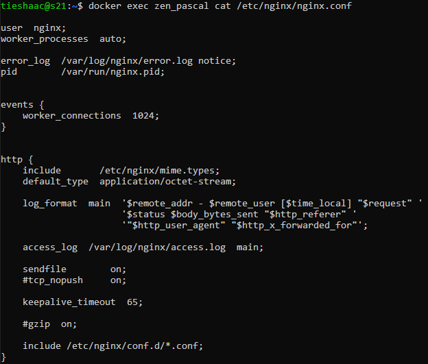

##### Создай на локальной машине файл *nginx.conf*.
- Создадим на локальной машине файл *nginx.conf*.: \
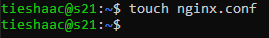

##### Настрой в нем по пути */status* отдачу страницы статуса сервера **nginx**.
- Настроим в нем по пути */status* отдачу страницы статуса сервера **nginx**: \
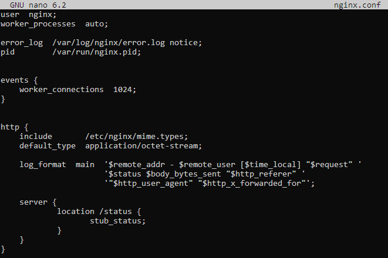

##### Скопируй созданный файл *nginx.conf* внутрь докер-образа через команду `docker cp`.
- Скопируем созданный файл *nginx.conf* внутрь докер-образа через команду `docker cp`: \
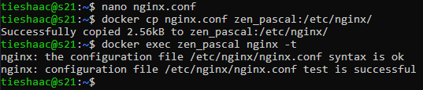

##### Перезапусти **nginx** внутри докер-образа через команду *exec*.
- Перезапускаем **nginx** внутри докер-образа через команду *exec*: \
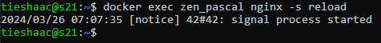

##### Проверь, что по адресу *localhost:80/status* отдается страничка со статусом сервера **nginx**.
- Проверяем, что по адресу *localhost:80/status* отдается страничка со статусом сервера **nginx**: \
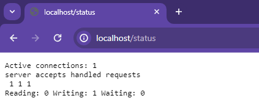

##### Экспортируй контейнер в файл *container.tar* через команду *export*.
- Экспортируем контейнер в файл *container.tar* через команду *export*: \
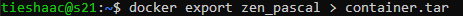

##### Останови контейнер.
- Останавливаем контейнер: \
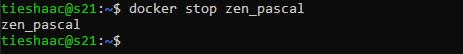

##### Удали образ через `docker rmi [image_id|repository]`, не удаляя перед этим контейнеры.
- Проверяем список образов и удалим последний образ: \
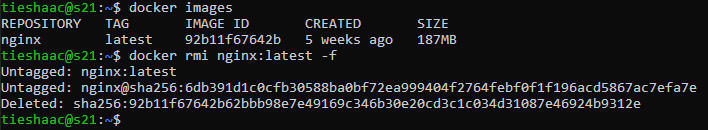

##### Удали остановленный контейнер.
- Удаляем остановленный контейнер: \
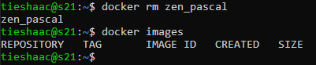

##### Импортируй контейнер обратно через команду *import*.
- Импортируем контейнер обратно через команду *import* и проверяем, что он вернулся обратно: \
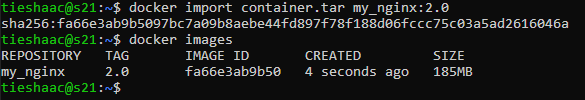

##### Запусти импортированный контейнер.
- Запускаем импортированный контейнер: \
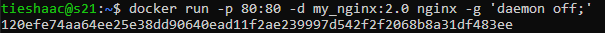

##### Проверь, что по адресу *localhost:80/status* отдается страничка со статусом сервера **nginx**.
- Проверяем, что  отдается страничка со статусом сервера **nginx**: \
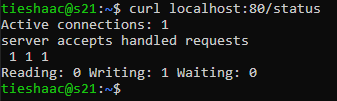

## Part 3. Мини веб-сервер

##### Напиши мини-сервер на **C** и **FastCgi**, который будет возвращать простейшую страничку с надписью `Hello World!`.
- Напишем мини-сервер, который будет возвращать `Hello World!`: \
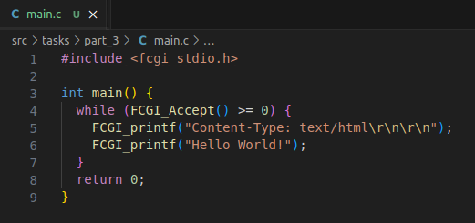
- Скопируем файл с кодом в докер: \

- Установим необходимые библиотеки для компиляции и работы мини-сервера: \
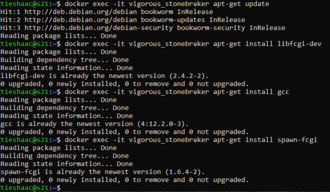

- Скомпилируем и запустим минис-сервер: \
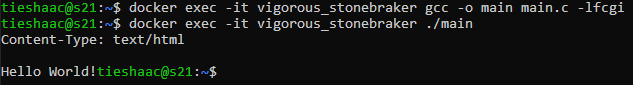

##### Запусти написанный мини-сервер через *spawn-fcgi* на порту 8080.
- Запустим мини-сервер через *spawn-fcgi* на порту 8080: \
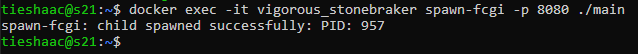

##### Напиши свой *nginx.conf*, который будет проксировать все запросы с 81 порта на *127.0.0.1:8080*.
- Напишем свой *nginx.conf*: \
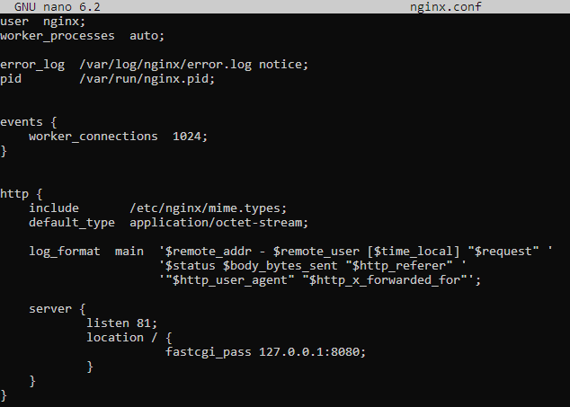
- Создаём, прописываем nginx.conf, копируем его в образ, и перезапускаем: \
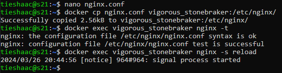

##### Проверь, что в браузере по *localhost:81* отдается написанная тобой страничка.
- Проверим, что по *localhost:81* отдается написанная страничка: \
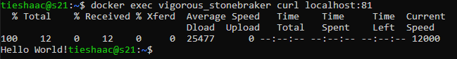

##### Положи файл *nginx.conf* по пути *./nginx/nginx.conf* (это понадобится позже).
- Положим файл *nginx.conf* по пути *./nginx/nginx.conf*: \
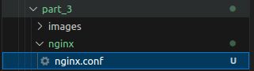

## Part 4. Свой докер

#### Напиши свой докер-образ, который:
1) Собирает исходники мини сервера на FastCgi из [Части 3](#part-3-мини-веб-сервер);
2) Запускает его на 8080 порту;
3) Копирует внутрь образа написанный *./nginx/nginx.conf*;
4) Запускает **nginx**. \
_**nginx** можно установить внутрь докера самостоятельно, а можно воспользоваться готовым образом с **nginx**'ом, как базовым._

- Пропишем Dockerfile в соответствии с этими пунктами: \
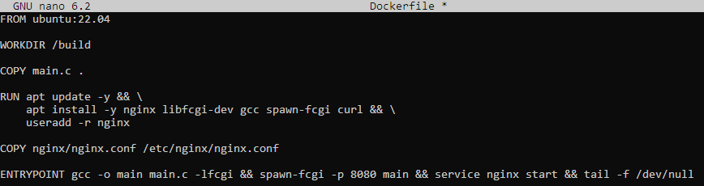

##### Собери написанный докер-образ через `docker build` при этом указав имя и тег.
- Собираем написанный докер-образ: \
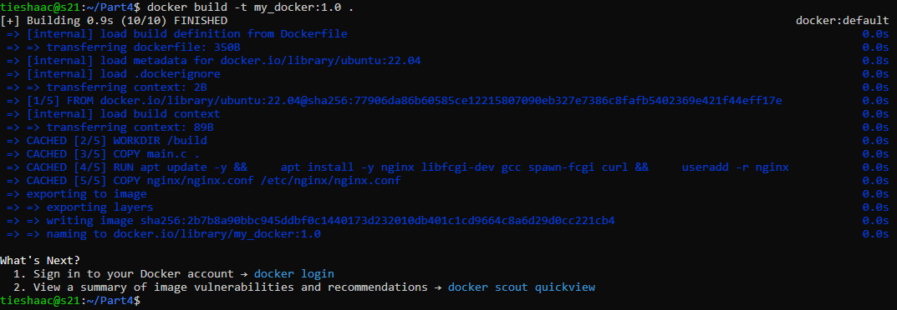

##### Проверь через `docker images`, что все собралось корректно.
- Проверяем, что все собралось корректно: \
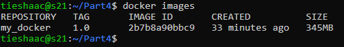

##### Запусти собранный докер-образ с маппингом 81 порта на 80 на локальной машине и маппингом папки *./nginx* внутрь контейнера по адресу, где лежат конфигурационные файлы **nginx**'а (см. [Часть 2](#part-2-операции-с-контейнером)).
- Запусти собранный докер-образ как указано выше: \
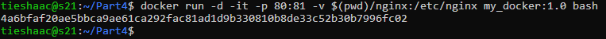
- Проверяем, что образ в докере запустился: \
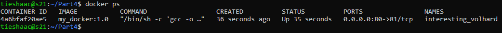

##### Проверь, что по localhost:80 доступна страничка написанного мини сервера.
- Проверяем, что по localhost:80 доступна страничка написанного мини сервера: \
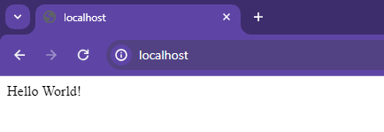

##### Допиши в *./nginx/nginx.conf* проксирование странички */status*, по которой надо отдавать статус сервера **nginx**.
- Допишем в *./nginx/nginx.conf* проксирование странички */status*: \
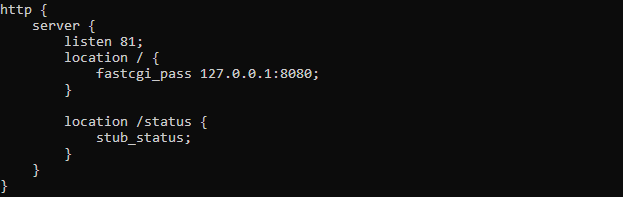

##### Перезапусти докер-образ.
- Перезапустим докер-образ: \

*Если всё сделано верно, то, после сохранения файла и перезапуска контейнера, конфигурационный файл внутри докер-образа должен обновиться самостоятельно без лишних действий*

##### Проверь, что теперь по *localhost:80/status* отдается страничка со статусом **nginx**
- Проверим, что теперь по *localhost:80/status* отдается страничка со статусом **nginx**: \
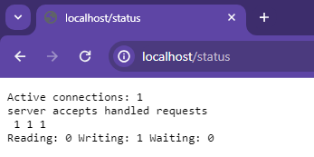
- Проверим также через утилиту **curl** по localhost:81/status: \
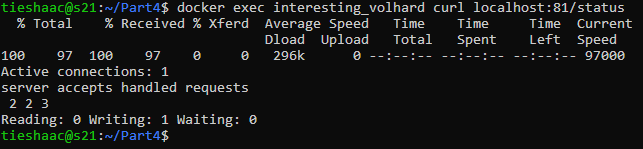

## Part 5. **Dockle**

Для начала установим утилиту Dockle следующим образом:

    # Получение последней версии
    VERSION=$(curl -s "https://api.github.com/repos/goodwithtech/dockle/releases/latest" | grep '"tag_name":' | -E 's/.*"v([^"]+)".*/\1/')

    # Загрузка .deb файла
    curl -Lo dockle.deb "https://github.com/goodwithtech/dockle/releases/download/v${VERSION}/le_${VERSION}_Linux-64bit.deb" 

    # Установка .deb файла
    sudo dpkg -i dockle.deb && rm dockle.deb

##### Просканируй образ из предыдущего задания через `dockle [image_id|repository]`.
- Просканируем утилитой **Dockle** образ образ `my_docker:1.0` с прошлой части: \
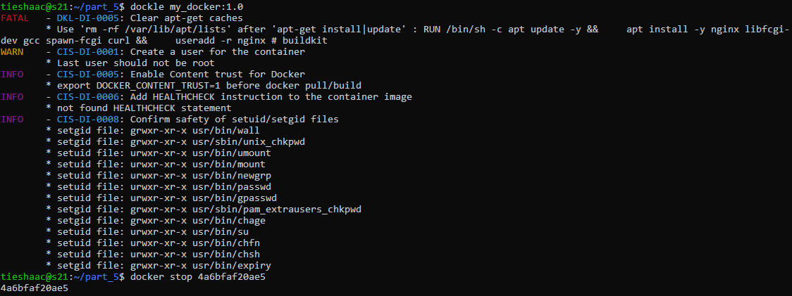

##### Исправь образ так, чтобы при проверке через **dockle** не было ошибок и предупреждений.

- Добавим команду `HEALTHCHECK   --interval=5m --timeout=3s`, которая отвечает за проверку работоспособности запущенных контейнеров. Это важно для обеспечения непрерывной работы и автоматического выявления проблем:  

- Флаги `--interval=5m --timeout=3s` указывают интервал между проверками и время ожидания ответа от контейнера. В данном случае, контроль будет проводиться каждые 5 минут, и если ответ не будет получен в течение 3 секунд, проверка будет считаться неудачной

- Также добавим команду `CMD curl -f http://localhost/ || exit 1`, которая использует инструмент curl для отправки запроса к веб-серверу в контейнере по адресу http://localhost/. Если запрос вернет ошибку (например, если веб-сервер недоступен), то процесс проверки здоровья контейнера завершится с кодом 1, что означает неудачу.

- Подтвердим безопасность файлов setuid и setgid командами `chmod u-s setuid-file` и `chmod g-s setgid-file`

- Добавим необходимые команды для исправления ворнингов: \
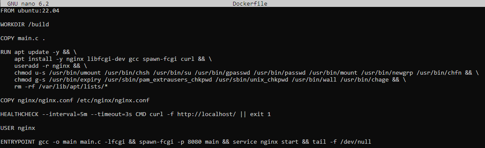

- Проверим билд нашего докерфайла утилитой **Dockle** после исправления: \
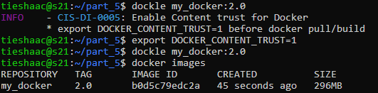

- После добавления в Dockerfile необходимых команд для исправления, в конечном итоге оставался один ворнинг по INFO, который также исправили через команду: `export DOCKER_CONTENT_TRUST=1` и при последующей проверке утилитой Dockle больше никаких ворнингов не выводится.

## Part 6. Базовый **Docker Compose**

##### Напиши файл *docker-compose.yml*, с помощью которого:
##### 1) Подними докер-контейнер из [Части 5](#part-5-инструмент-dockle) _(он должен работать в локальной сети, т.е. не нужно использовать инструкцию **EXPOSE** и мапить порты на локальную машину)_.
##### 2) Подними докер-контейнер с **nginx**, который будет проксировать все запросы с 8080 порта на 81 порт первого контейнера.
- Поднимем докер-контейнер с **nginx**, который будет проксировать все запросы с 8080 порта на 81 порт первого контейнера: \
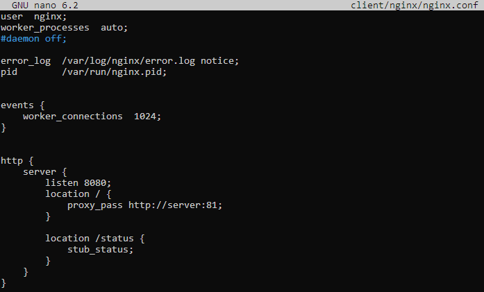

##### Замапь 8080 порт второго контейнера на 80 порт локальной машины.
- Замапим 8080 порт второго контейнера на 80 порт локальной машины: \
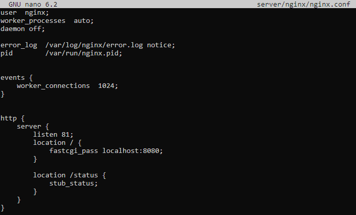

##### Вернемся к первой поставленной задаче и напишем файл *docker-compose.yml* с вышеописанными указаниями:
- Содержание файла *docker-compose.yaml*: \
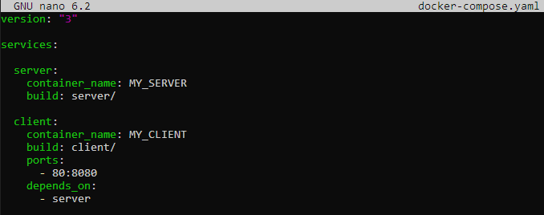

##### Останови все запущенные контейнеры.
- Остановим все запущенные контейнеры: \
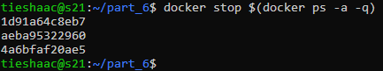

##### Собери и запусти проект с помощью команд `docker-compose build` и `docker-compose up`.
- Соберем проект с помощью команды `docker-compose build`: \

- Запустим проект с помощью команды `docker-compose up`: \

##### Проверь, что в браузере по *localhost:80* отдается написанная тобой страничка, как и ранее.
- Проверим командой `curl`, что по *localhost:80* отдается написанная страничка, как и ранее: \

- Проверьим в браузере: \
